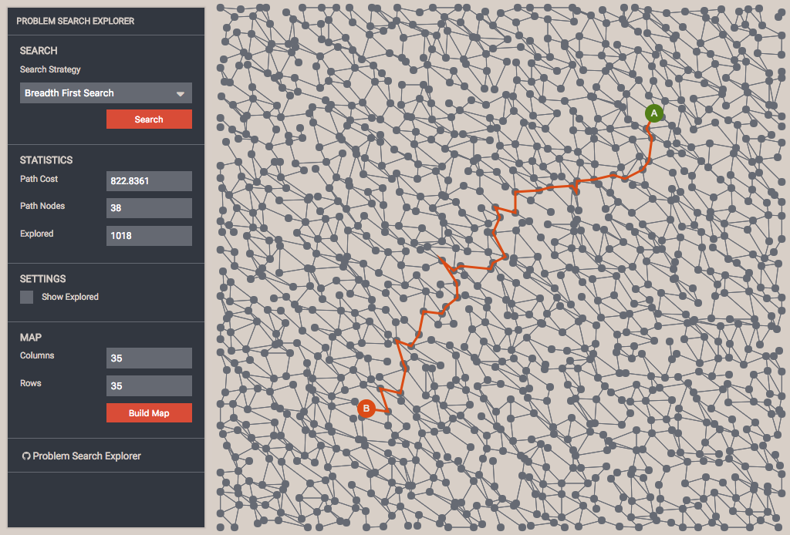

# Problem Search Explorer

A Vue application: generates a randomized map to explore different search strategies.

The application is build with:

* Map [https://github.com/marcbreitung/problem-map-generator](https://github.com/marcbreitung/problem-map-generator)
* Visualisation [https://github.com/marcbreitung/problem-graph-visualisation](https://github.com/marcbreitung/problem-graph-visualisation)
* Search [https://github.com/marcbreitung/problem-search](https://github.com/marcbreitung/problem-search)

[https://marcbreitung.github.io/problem-search-explorer/#/](https://marcbreitung.github.io/problem-search-explorer/#/)

